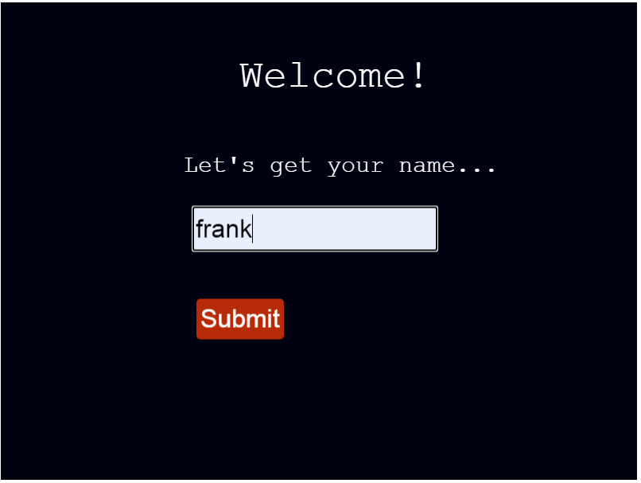
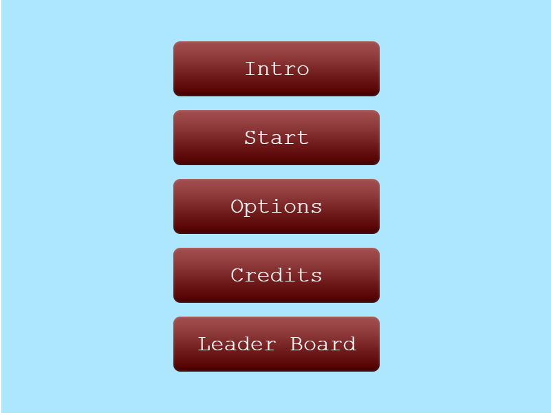
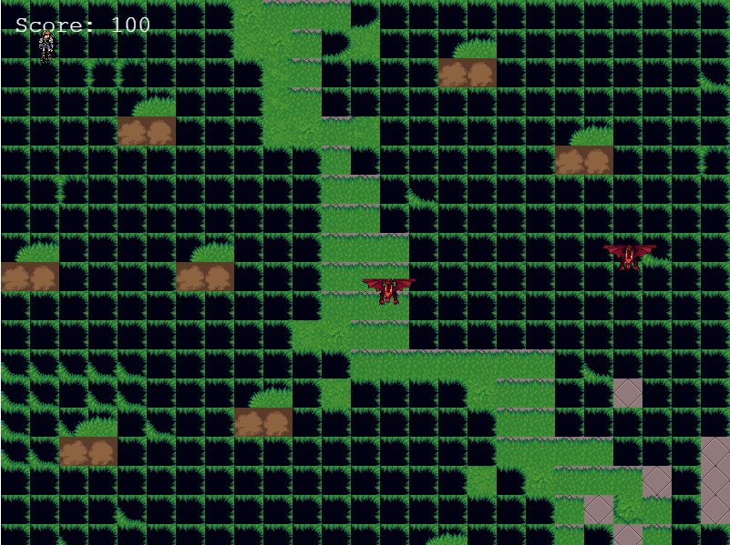
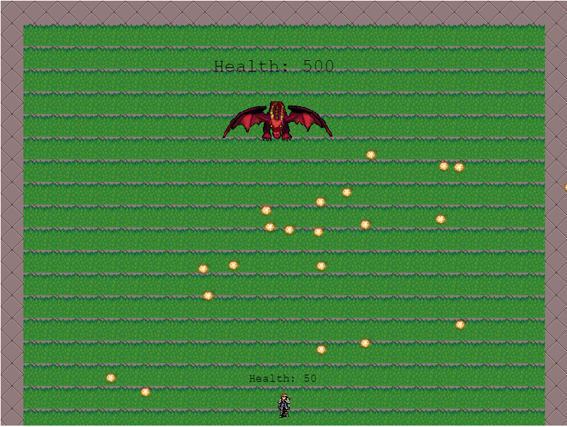

# JS-CAPSTONE

## Description

Please click [here](https://www.notion.so/microverse/RPG-game-f94a617841e240a293c0b6928beebe89) to view the project specifications

You can also checkout the GDD of the project [here](https://github.com/frankopkusianwar/js-capstone/blob/feature-game/src/assets/docs/gdd.md)

## How To Play

- When the App starts, you will be prompted to enter a username
- After submission of the name, you will be presented the menu page with the following options:

- Intro: This will take you though the game story;
- Start: Starts the game.
- Options: Allows you to mute or unmute game sound;
- Credits: Shows the Credits that helped build the app;
- LeaderBoard: Shows the game scores by rank from the highest;
Note: When the game starts, the intro is played and there is an option to skip it

When the game starts, use the following to move the player:
- W: move up
- A: move left
- S: move down
- D: move right

- while at the battle scene, move to the move to the dragon and use space key to attack

Your score will only be captured when the game is over!

## First page

## Menu Page

## World Scene page

## Battle Scene page

## Built With

- Html5
- CSS3
- JavaScript
- Webpack
- Phaser3

## Live Demo

[Live Demo Link](https://sharp-shirley-7ecb74.netlify.app)

## Getting Started

To get a local copy up and running follow these simple example steps.

### Prerequisites

- Node

## Instructions

- git clone https://github.com/frankopkusianwar/js-capstone.git
- cd js-capstone
- npm install
- npm start

### Usage

- Now you can play the game.

## Author

👤 **Okiror Frank**

- Github: [@frankopkusianwar](https://github.com/frankopkusianwar)
- Twitter: [@franko0781](https://twitter.com/franko0781)
- Linkedin: [Okiror Frank](https://linkedin.com/in/frank-okiror)
- Email: okirorfrank3@gmail.com

## 🤝 Contributing

Contributions, issues and feature requests are welcome!

Feel free to check the [issues page](issues/).

## Show your support

Give a ⭐️ if you like this project!

## Acknowledgments

- Microverse, standup team and the microverse community for helping build the skills that were used on this project

## 📝 License

This project is [MIT](lic.url) licensed.
