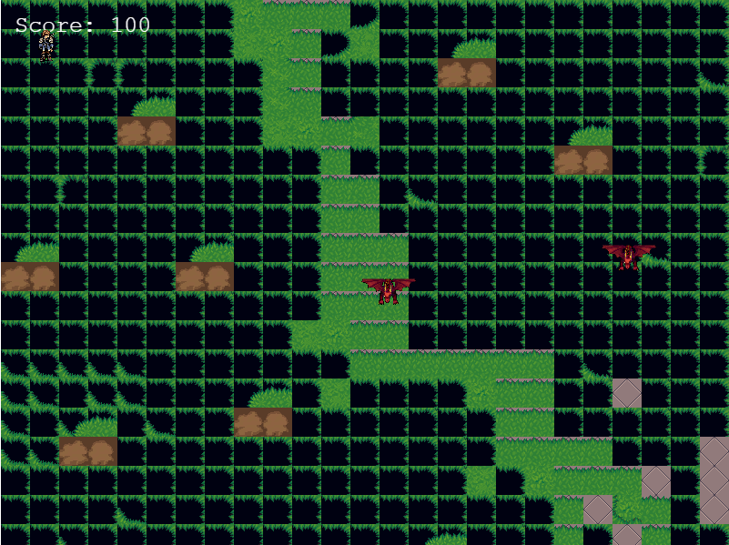

# Introduction

Here I explain the Work I did to come up with the game, I wrote how I planned the game and the while story of this game. 

# Story

## Intro

Thousands of years ago, in the era when dragons still existed. They used to invade villages where many people lost their lives due to these attackscks. There emerged a hero named Daniel the son of  a Dragon slayer whose farther had trained and given the techniques of killing dragons. Daniel moves into an adventourous world where he comes face to face with these dragons and fights them only with his sword!! Daniel is the only hope for the human race. GOOD LUCK !!

## PHASE 1 (World Scene I)

Daniel arrives at the scene which is a world that is the dragon territory

He attacks dragons one by one

## PHASE 2 (Battle Scene)

When daniel gets near the dragon he is supposed to kill

He is moved into a one on one scene with this dragon

The dragon uses fireballs as its weapon

Daniel uses the sword as his weapon( a flashing sword)

Both daniel and the dragon have health as a value that deacreases when attacked

When daniels health gets to zero, he dies and the game ends

when the dragon health gets to zero, daniel wins!! and he goes back to the world scene to take on another

## Scenes

- World Scene

Battle Scene

## Enemy

This is the description of the enemy's features:

- Dragon: Shoots fireballs to attack.

## Attacks

The attacks are from the dragon that spits fireballs

# Developer's Notes

This project was developed in these stages:

- Stage 1: Learning how to use Phaser 3, following tutorials and how to setup a game's structure built with Javascript (1 day).
- Stage 2: Building the GDD (0.5 day).
- Stage 3: Creating the project's codes organizational structure (0.5 day).
- Stage 4: Creating the project's scenes (1 day)
- Stage 5: Creating the project's classes and tests (1 day).
- Stage 6: Testing the gameplay, fixing bugs and deployment (1 day).

# Making Of

This project was built using [Phaser 3](https://phaser.io/phaser3), [Webpack](https://webpack.js.org/) and Javascript.
